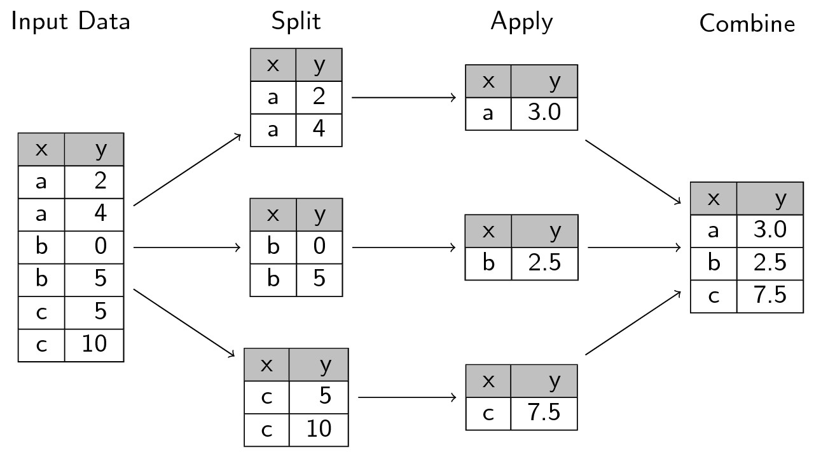
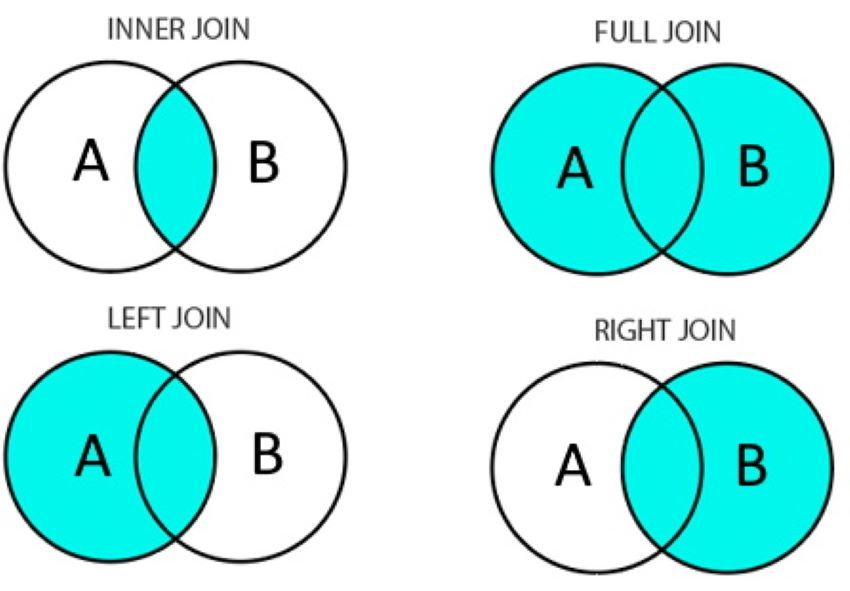

# Mapas en acción: Análisis y visualización espacial con R

## 2. Afinando las herramientas

La idea de este encuentro es profundizar en operaciones complejas para procesamiento de tablas, conocer algunas operaciones espaciales y complejizar las técnicas de visualización.

## 2.1. Pregunta-problema

El objetivo será comparar el desempeño de las cinco fuerzas que compitieron en las elecciones nacionales de 2023 a nivel provincial. En términos globales, ¿cómo fue el resultado? Y sobre cada fuerza en particular, ¿dónde tuvieron mejores y peores resultados?

Cargamos las librerías.

```{r}
library(tidyverse)
library(sf)
```

## 2.2. Las estrellas de `tidyverse`: grupos y uniones

### Operando sobre grupos

La función `group_by()` nos permite hacer ciertos cálculos por grupos. El esquema lógico es el siguiente.



Primero cargamos la base de datos que utilizamos el encuentro pasado. Visualicemos el resultado de cada partido en todas las provincias.

```{r}
res <- read_csv(params$ruta_csv)

res %>% 
  ggplot(aes(y=reorder(Partido,Porcentaje)))+
  geom_point(aes(x=Porcentaje), color="black", size=4, alpha=.3)+
  labs(x="", y="",
    title="Resultados (%) por partido",
       subtitle="Elecciones generales 2023", 
       caption="Elaboración propia según datos de datacp.ar")+
  theme_minimal()

```

Es un poco difícil entender los resultados de esta forma. Calculemos el promedio, mínimo y máximo de cada uno de los partidos.

```{r}

grouped <- res %>% 
  group_by(Partido) %>% 
  summarise(promedio = round(mean(Porcentaje),1),
            min = round(min(Porcentaje),1),
            max = round(max(Porcentaje),1)) %>% 
  arrange(desc(promedio)) 

grouped
```

También podemos verlo gráficamente.

```{r}
grouped %>% 
  ggplot(aes(y=reorder(Partido,promedio)))+
  geom_point(aes(x=promedio, color="promedio"), size=4)+
  geom_segment(aes(x=min, xend=max)) +
  geom_text(aes(x = promedio, label =promedio), 
            vjust = -1, color = "black") +
  geom_text(aes(x = min, 
                label = ifelse(Partido == first(reorder(Partido, promedio)), "min", "")), 
            vjust = -.5, hjust = 0, color = "grey40") +
  geom_text(aes(x = max, 
                label = ifelse(Partido == first(reorder(Partido, promedio)), "max", "")), 
            vjust = -.5, hjust = 1, color = "grey40") +
  scale_color_manual(values = c("promedio" = "red")) +
  labs(x="", y="", color="",
    title="Rango de resultados (%) por partido",
       subtitle="Elecciones generales 2023", 
       caption="Elaboración propia según datos de datacp.ar")+
  theme_minimal()
```

### Uniones

Para cruzar distintas bases de datos podemos usar las funciones `_join()` disponibles en `tidyverse`. Una buena práctica es chequear que las claves funcionen correctamente antes de realizar la unión. Como ya lo hicimos el encuentro anterior vamos a traer la limpieza.



```{r}
geo <- st_read(params$ruta_shp) %>% 
  mutate(key = str_to_upper(NAM), 
         key = stringi::stri_trans_general(key, "Latin-ASCII"), 
         key = str_replace(key, ", ANTARTIDA E ISLAS DEL ATLANTICO SUR", "")) %>% 
  select(key, geometry)
```

```{r}
res %>% distinct(id) %>% arrange(id) %>% as.vector()

geo %>% st_drop_geometry() %>% distinct(key) %>% arrange(key) %>% as.vector()
```

Para utilizar de ejemplo, intentemos realizar las distintas uniones con dos versiones parciales de las tablas que estamos trabajando.

```{r}
res_short <- res %>%
  mutate(fuente = "resultados") %>% 
  select(id, fuente) %>% 
  distinct() %>% 
  filter(id %in% c("CHUBUT","CORRIENTES", "BUENOS AIRES"))
res_short
```

Recortemos también la base de datos geográfica.

```{r}
geo_short <- geo %>%
  st_drop_geometry() %>% 
  mutate(fuente = "geo",
         id = key) %>% 
  select(id, fuente) %>% 
  distinct() %>% 
  filter(id %in% c("SAN JUAN","SAN LUIS", "BUENOS AIRES"))
geo_short
```

En el caso de `inner_join()`, sólo permanecen las claves coincidentes.

```{r}
res_short %>% 
  inner_join(geo_short, by="id")
```

En el caso de `left_join()`, sólo permanecen las claves que existen en la primera base.

```{r}
res_short %>% 
  left_join(geo_short, by="id")
```

En el caso de `right_join()`, sucede lo opuesto.

```{r}
res_short %>% 
  right_join(geo_short, by="id")
```

En el caso de `full_join()`, permanecen todas las claves.

```{r}
res_short %>% 
  full_join(geo_short, by="id")
```

## 2.3. Operaciones espaciales

En el rubro que nos proponemos trabajar los archivos geográficos suelen estar curados y listos para usar. Muchas de las operaciones espaciales que vamos a ver ahora están pensadas para situaciones extraordinarias o para ser creativos al momento de la visualización de la información.

::: {.panel-tabset .nav-pills}
### Buffer

El buffer genera una zona alrededor de un objeto geométrico a la distancia indicada.

```{r}
# definiciones
buffer_dist <- 3*10e3
prov <- "CORDOBA"

#calculo
geo %>%
  filter(key==prov) %>% 
  st_buffer(dist=buffer_dist) %>% 
  ggplot()+
  geom_sf(fill="lightblue")+
  labs(title=paste0(prov," con buffer"),
    subtitle=paste0("dist de ", buffer_dist))
```

### Boundary

Extrae los bordes de un polígono.

```{r}
geo %>% 
  filter(key == prov) %>% 
  st_boundary()

geo %>% 
  filter(key==prov) %>% 
  st_boundary() %>% 
  ggplot()+
  geom_sf(color="red")+
  labs(title=paste0("Bordes de ", prov))
  
```

### Simplify

Reduce el número de vértices de un polígono para simplificar su forma, manteniendo la geometría aproximada. Útil para reducir el peso de un archivo y trabajarlo más cómodamente.

```{r}
prov <- "TUCUMAN"
geo %>% 
  filter(key==prov) %>% 
  st_simplify(dTolerance = 10000) %>% 
  ggplot()+
  geom_sf(aes(color="Simplificado"), alpha=0, show.legend=TRUE)+
  geom_sf(data=filter(geo, key==prov), aes(color="Real"), alpha=0, show.legend=TRUE)+
  labs(title=paste0("Bordes de ", prov), 
       subtitle="Simplificado y real")+
  scale_color_manual(values = c("Simplificado" = "red", "Real" = "black")) # para definir colores
```

### Centroid

Calcula el centro geométrico de un polígono.

```{r}
geo_centroid <- geo %>% st_centroid()
geo_centroid %>% head(2)
```

Lo vemos gráficamente.

```{r}
provs <- c("TUCUMAN", "SANTIAGO DEL ESTERO", "SALTA", "JUJUY", "CHACO", "FORMOSA", "CATAMARCA")
geo_centroid_filtrado <- geo_centroid %>% filter(key %in% provs)

geo_centroid_filtrado$X <- geo_centroid_filtrado %>% st_coordinates() %>% as.data.frame() %>% select(X) %>% pull()
geo_centroid_filtrado$Y <- geo_centroid_filtrado %>% st_coordinates() %>% as.data.frame() %>% select(Y) %>% pull()

geo %>% 
  filter(key %in% provs) %>% 
  ggplot()+
  geom_sf()+
  geom_sf(data=geo_centroid_filtrado, color="red")+
  geom_label(data=geo_centroid_filtrado, aes(label=key, x=X, y=Y+.5), size=3, )+
  labs(x="", y="", title="Provincias y sus centroides")
```

### Área

Calcula el área de cada polígono. Se devuelve en las unidades del sistema de coordenadas.

```{r}
geo <- geo %>% 
  mutate(area_m2 = st_area(geometry), 
         area_km2 = units::set_units(area_m2, km^2), 
         area_km2 = round(as.numeric(area_km2),0))

geo %>%
  filter(key %in% provs) %>% 
  ggplot()+
  geom_sf(aes(fill=area_km2))+
  scale_fill_viridis_c()+
  labs(x="", y="", title="Provincias coloreadas según área")
```

¿Y si se incluyen todas las provincias?

```{r}
geo %>%
  ggplot()+
  geom_sf(aes(fill=area_km2))+
  scale_fill_viridis_c(labels = scales::label_number(big.mark = ".", decimal.mark = ",")) +
  labs(x="", y="", title="Provincias coloreadas según área")

```

### Recortar

A veces existen elementos geográficos que no deseamos representar gráficamente. No siempre pueden filtrarse: en este caso, la información geográfica de la Antártida está incluida en el polígono de Tierra del Fuego. En estos casos, se pueden recortar el valor de *geometry* según latitud y longitud. Calculamos nuevamente el área ahora sin incluir a la Antártida en el cálculo.

```{r}
bbox <- st_bbox(c(xmin = -75, ymin = -58, xmax = -52, ymax = -20), crs = st_crs(geo))

geo <- geo %>% 
  st_crop(bbox) %>% 
  mutate(area_m2 = st_area(geometry), 
         area_km2 = units::set_units(area_m2, km^2), 
         area_km2 = round(as.numeric(area_km2),0))

geo %>%
  ggplot()+
  geom_sf(aes(fill=area_km2))+
  scale_fill_viridis_c(labels = scales::label_number(big.mark = ".", decimal.mark = ",")) +
  labs(x="", y="", title="Provincias coloreadas según área")

```
:::

### Agregaciones espaciales

La agregación espacial se utiliza para construir objetos geográficos a partir de otros más pequeños. En este caso vamos a ejemplificar construyendo un objeto de **regiones** a partir de nuestro objeto de provincias. Primero construimos la variable de *región* en nuestro dataframe.

```{r}
geo <- geo %>%
  mutate(region = case_when(
    key %in% c("BUENOS AIRES", "CIUDAD AUTONOMA DE BUENOS AIRES") ~ "BA",
    key %in% c("CORDOBA", "SANTA FE", "ENTRE RIOS", "LA PAMPA") ~ "Centro",
    key %in% c("JUJUY", "SALTA", "TUCUMAN", "CATAMARCA", "LA RIOJA", "SANTIAGO DEL ESTERO") ~ "NOA",
    key %in% c("CHACO", "CORRIENTES", "FORMOSA", "MISIONES") ~ "NEA",
    key %in% c("SAN JUAN", "SAN LUIS", "MENDOZA") ~ "Cuyo",
    key %in% c("NEUQUEN", "RIO NEGRO", "CHUBUT", "SANTA CRUZ", "TIERRA DEL FUEGO") ~ "Patagonia",
    TRUE ~ NA
  )) 

geo %>% st_drop_geometry() %>% count(region) %>% arrange(desc(n))

geo %>% 
  ggplot()+
  geom_sf(aes(fill=region))+
  labs(title="Regiones")
```

Ahora bien, construyamos el archivo geográfico a nivel región.

```{r}
region <- geo %>% 
  group_by(region) %>% 
  summarise(area_km2 = sum(area_km2),
            geometry = st_union(geometry)) 

region

region %>% 
  ggplot()+
  geom_sf(aes(fill=area_km2))+
  scale_fill_viridis_c(labels = scales::label_number(big.mark = ".", decimal.mark = ","))+
  labs(title="Regiones")
```

Se podría también construir a nivel país. En ese caso, nuestro objeto tendría una sola fila.

```{r}
geo %>% 
  mutate(pais="ARG") %>% 
  group_by(pais) %>% 
  summarise(area_km2 = sum(area_km2),
            geometry = st_union(geometry)) %>% 
  ggplot()+
  geom_sf(aes(fill=area_km2))+
  scale_fill_viridis_c(labels = scales::label_number(big.mark = ".", decimal.mark = ","))+
  labs(title="Agregación a nivel país")
```

## 🧪 Práctica corta (15 minutos)

Elegir y resolver alguna de las siguientes consignas.

-   Sumar la mediana al gráfico de promedio por provincia. Usar otro color para distinguir las dos medidas de centralidad.
-   Tomar una de las regiones ya creadas y graficar el área en los polígonos. Sumar centroides y etiquetas.
-   Graficar el área de para todas las provincias utilizando bordes simplificados. Jugar con el valor de simplificación para que se note la operación.

## 2.4. Visualizando resultados electorales

### Secuenciales

Lo primero es unir los reusltados electorales con la información geográfica. Utilizaremos el formato *long* porque es más amable para construir algunos gráficos con `ggplot()`.

```{r}
geo <- geo %>% 
  select(key, region, geometry)

df <- res %>% 
  mutate(key = id,
         Porcentaje = as.numeric(Porcentaje)) %>% 
  left_join(geo, by="key") %>% 
  st_as_sf()

df %>% 
  head()
```

Ante todo, volvamos adonde dejamos el último encuentro. Utilizamos una paleta secuencial que utiliza un mismo color en distintas intensidades.

```{r}
df %>% 
  filter(Partido == "LA LIBERTAD AVANZA") %>% 
  ggplot()+
  geom_sf(aes(fill=Porcentaje)) +
  scale_fill_distiller(palette = "Purples", direction = 1) + 
  labs(x="", y="", fill="%",
       title="La Libertad Avanza", 
       subtitle="Elecciones generales 2023", 
       caption="Elaboración propia según datos de datacp.ar")+
  theme_void()+
  theme(plot.caption = element_text(hjust = 0))
```

Hay algunos elementos estéticos que tiene sentido modificar. Por ejemplo, marcar mejor los bordes (con el argumento `color` dentro de `geom_sf()`), agregar etiquetas con `geom_sf_label()` o formatear los números de la leyenda con `scales`.

```{r}
df %>% 
  filter(Partido == "LA LIBERTAD AVANZA") %>% 
  mutate(label = round(Porcentaje)) %>% 
  ggplot()+
  geom_sf(aes(fill=Porcentaje), color="black") +
  geom_sf_label(aes(label=label), size = 2, fill = "white", color = "black", alpha=.5)+
  scale_fill_distiller(palette = "Purples", direction = 1, labels = scales::label_number(suffix = "%")) + 
  labs(x="", y="", fill="",
       title="La Libertad Avanza", 
       subtitle="Elecciones generales 2023", 
       caption="Elaboración propia según datos de datacp.ar")+
  theme_void()+
  theme(plot.caption = element_text(hjust = 0))
```

A veces las escalas continuas son difíciles para interpretar los resultados. Se puede recurrir a generar grupos con los valores analizados. Por defecto, `scale_fill_fermenter()` utiliza rangos de intervalos de igual tamaño.

```{r}
df %>% 
  filter(Partido == "LA LIBERTAD AVANZA") %>% 
  mutate(label = round(Porcentaje)) %>% 
  ggplot()+
  geom_sf(aes(fill=Porcentaje), color="black") +
  scale_fill_fermenter(palette = "Purples", direction = 1, 
                       n.breaks=3,
                       labels = scales::label_number(suffix = "%")) + 
  labs(x="", y="", fill="",
       title="La Libertad Avanza", 
       subtitle="Elecciones generales 2023", 
       caption="Elaboración propia según datos de datacp.ar")+
  theme_void()+
  theme(plot.caption = element_text(hjust = 0))
```

Podría querer definir los puntos de corte. Por ejemplo, en el total nacional.

```{r}
df %>% 
  filter(Partido == "LA LIBERTAD AVANZA") %>% 
  mutate(label = round(Porcentaje)) %>% 
  ggplot()+
  geom_sf(aes(fill=Porcentaje), color="black") +
  scale_fill_fermenter(palette = "Purples", direction = 1, 
                       breaks = c(0, 29, 100),
                       labels = scales::label_number(suffix = "%")) + 
  labs(x="", y="", fill="",
       title="La Libertad Avanza", 
       subtitle="Elecciones generales 2023", 
       caption="Elaboración propia según datos de datacp.ar")+
  theme_void()+
  theme(plot.caption = element_text(hjust = 0))
```

Hay diversas formas de generar grupos a partir de una serie continua de valores.

::: {.panel-tabset .nav-pills}
### Intervalos iguales

Es útil cuando te interesa más el valor que la cantidad de unidades que están incluidas en el rango.

```{r}

k <- 3

serie <- df %>% 
  filter(Partido == "LA LIBERTAD AVANZA") %>%
  pull(Porcentaje) 

breaks <- classInt::classIntervals(serie, n=k, style="equal")$brks

df %>% 
  filter(Partido == "LA LIBERTAD AVANZA") %>% 
  mutate(label = round(Porcentaje)) %>% 
  ggplot()+
  geom_sf(aes(fill=Porcentaje), color="black") +
  scale_fill_fermenter(palette = "Purples", direction = 1, 
                       breaks = breaks,
                       labels = scales::label_number(suffix = "%")) + 
  labs(x="", y="", fill="",
       title="La Libertad Avanza - Iguales", 
       subtitle="Elecciones generales 2023", 
       caption="Elaboración propia según datos de datacp.ar")+
  theme_void()+
  theme(plot.caption = element_text(hjust = 0))
```

### Cuantiles

Es útil cuando se precisa que cada grupo tenga la misma cantidad de observaciones.

```{r}
breaks <- classInt::classIntervals(serie, n=k, style="quantile")$brks

df %>% 
  filter(Partido == "LA LIBERTAD AVANZA") %>% 
  mutate(label = round(Porcentaje)) %>% 
  ggplot()+
  geom_sf(aes(fill=Porcentaje), color="black") +
  scale_fill_fermenter(palette = "Purples", direction = 1, 
                       breaks = breaks,
                       labels = scales::label_number(suffix = "%")) + 
  labs(x="", y="", fill="",
       title="La Libertad Avanza - Cuantiles", 
       subtitle="Elecciones generales 2023", 
       caption="Elaboración propia según datos de datacp.ar")+
  theme_void()+
  theme(plot.caption = element_text(hjust = 0))
```

### Cortes naturales

Usualmente se utiliza el método *Jenks*. Los grupos que se forman buscan maximizar sus diferencias; en otras palabras, se colocan los límites donde hay mayores diferencias entre los valores.

```{r}
breaks <- classInt::classIntervals(serie, n=k, style="jenks")$brks

df %>% 
  filter(Partido == "LA LIBERTAD AVANZA") %>% 
  mutate(label = round(Porcentaje)) %>% 
  ggplot()+
  geom_sf(aes(fill=Porcentaje), color="black") +
  scale_fill_fermenter(palette = "Purples", direction = 1, 
                       breaks = breaks,
                       labels = scales::label_number(suffix = "%")) + 
  labs(x="", y="", fill="",
       title="La Libertad Avanza - Jenks", 
       subtitle="Elecciones generales 2023", 
       caption="Elaboración propia según datos de datacp.ar")+
  theme_void()+
  theme(plot.caption = element_text(hjust = 0))
```

### Comparación

Comparación entre métodos de clasificación.

```{r}
breaks_df <- tibble(
  metodo = c("Equal (intervalos iguales)", 
             "Quantile (cuantiles)", 
             "Jenks (cortes naturales)"),
  breaks = list(
    classInt::classIntervals(serie, n = k, style = "equal")$brks,
    classInt::classIntervals(serie, n = k, style = "quantile")$brks,
    classInt::classIntervals(serie, n = k, style = "jenks")$brks
  )
) %>%
  unnest_longer(breaks)

ggplot(data.frame(Porcentaje = serie), aes(x = Porcentaje)) +
  geom_histogram(bins = 3, fill="gray") +
  geom_vline(
    data = breaks_df,
    aes(xintercept = breaks, color = metodo),
    linewidth = 0.9,
    alpha=.5
  ) +
  scale_color_manual(values = c("#1b9e77", "#d95f02", "#7570b3")) +
  labs(
    title = "Comparación de métodos de clasificación",
    subtitle = paste("k =", k, "grupos"),
    x = "",
    y = "",
    color = "Método de corte"
  ) +
  theme_minimal(base_size = 12)
```
:::

### Divergentes

Cuando la información que estamos mostrando tiene un rango que incluye números negativos y positivos, puede ser más adecuado utilizar una paleta divergente, compuesta por dos colores y un centro neutro (blanco, gris, negro). Carguemos los resultados de las últimas elecciones para utilizarla.

```{r}
g2025 <- readxl::read_excel(params$ruta_g25) %>%
  rename(porcentaje_2025 = Porcentaje) %>% 
  select(-Elecciones)

dif <- df %>% 
  filter(Partido == "LA LIBERTAD AVANZA") %>% 
  left_join(g2025, by=c("key","Partido")) %>% 
  mutate(dif = porcentaje_2025 - Porcentaje) 
  
dif %>% 
  ggplot()+
  geom_sf(aes(fill=dif), color="black") +
  scale_fill_distiller(palette = "RdYlGn", direction = 1,
                       labels = scales::label_number(suffix = "%"),
                       ) + 
  labs(x="", y="", fill="",
       title="La Libertad Avanza", 
       subtitle="Diferencia entre 2025 y 2023", 
       caption="Elaboración propia según datos de datacp.ar")+
  theme_void()+
  theme(plot.caption = element_text(hjust = 0))
```

Es más adecuado que el color neutro esté cerca del valor neutro. En este caso, cero y controlar la equivalencia de en las intensidades entre los dos colores.

```{r}
dif %>% 
  ggplot()+
  geom_sf(aes(fill=dif), color="black") +
  scale_fill_gradient2(low = "#D73027", mid = "#FFFFBF", high = "#1A9850",
                       midpoint=0, limits=c(-23, 23),
                       labels = scales::label_number(suffix = "%")
                       ) + 
  labs(x="", y="", fill="",
       title="La Libertad Avanza", 
       subtitle="Diferencia entre 2025 y 2023", 
       caption="Elaboración propia según datos de datacp.ar")+
  theme_void()+
  theme(plot.caption = element_text(hjust = 0))
```

### Cualitativas

El último tipo de paletas se utiliza cuando el valor que presentado es categórico. Podríamos intentar con ganador por provincia.

```{r}
colores <- c( "UNION POR LA PATRIA" = "skyblue",
              "LA LIBERTAD AVANZA" = "purple",
              "JUNTOS POR EL CAMBIO" = "orange",
              "HACEMOS POR NUESTRO PAIS" = "green",
              "FRENTE DE IZQUIERDA Y DE TRABAJADORES - UNIDAD" = "red" )

df %>% 
  group_by(key) %>% 
  slice_max(order_by=Porcentaje, n=1) %>% 
  ggplot()+
  geom_sf(aes(fill=Partido), color="black")+ 
  scale_fill_manual(values=colores, name="Ganador")+
  labs(x="", y="", fill="",
       title="Ganador por provincia", 
       subtitle="Elecciones generales 2023", 
       caption="Elaboración propia según datos de datacp.ar")+
  theme_void()+
  theme(plot.caption = element_text(hjust = 0))

```

------------------------------------------------------------------------

## 🧩 Para seguir practicando

-   Graficar la diferencia del peronismo entre 2025 y 2023.
-   Graficar ganador de las elecciones 2023 pero a nivel región.
-   Graficar la diferencia de La Libertad Avanza entre 2025 y 2023 utilizando una paleta divergente pero con sus valores clasificados en 3 o 5 grupos.

------------------------------------------------------------------------

## 2.5 Bonus track

Si quisiera replicar este mismo mapa para distintos partidos sin repetir cinco veces el mismo código, una alternativa opción es la siguiente.

```{r}
paletas <- c( "UNION POR LA PATRIA" = "Blues",
              "LA LIBERTAD AVANZA" = "Purples",
              "JUNTOS POR EL CAMBIO" = "Oranges",
              "HACEMOS POR NUESTRO PAIS" = "Greens",
              "FRENTE DE IZQUIERDA Y DE TRABAJADORES - UNIDAD" = "Reds")

funcion_plot <- function(p) {
  df %>%
    filter(Partido == p) %>%
    ggplot() +
    geom_sf(aes(fill = Porcentaje), color = "black", size = 0.1) +
    scale_fill_fermenter(palette = paletas[p], direction = 1, n.breaks=3,
                         labels = scales::label_number(suffix = "%")) +
    labs(title = str_wrap(p, 15), fill="") +
    theme_void() +
    theme(plot.title = element_text(hjust = 0.5, size=10),
          legend.position = "bottom",
          legend.direction = "horizontal")
}

plots <- lapply(names(paletas), funcion_plot)

# Combinar los plots
patchwork::wrap_plots(plots, ncol = 5) + 
  patchwork::plot_annotation(title="Elecciones generales 2023",
                             subtitle="Resultados por partido")
```
