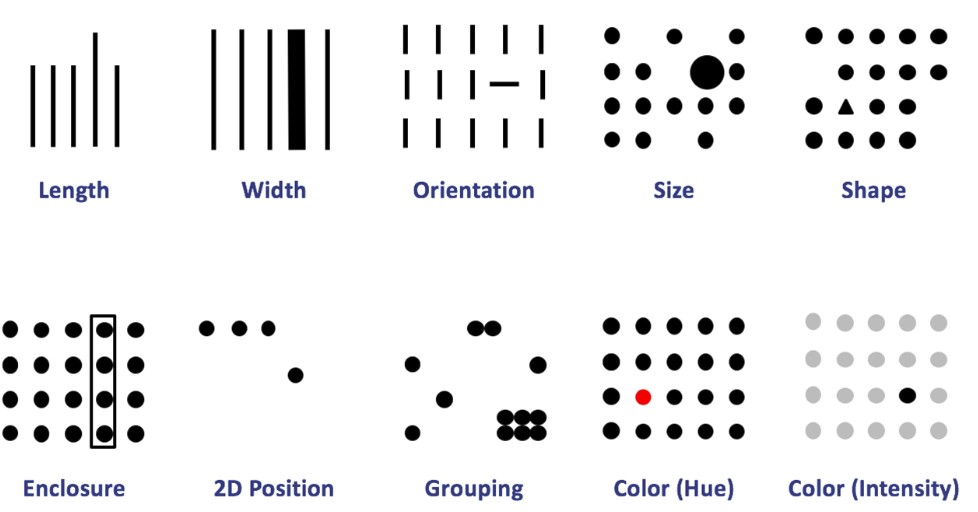

# Mapas en acción: Análisis y visualización espacial con R

## 4. Analítica avanzada

Despejando el ruido. Aquí se buscará identificar patrones regionales del voto en la Ciudad de Buenos Aires. 

## 4.1. Pregunta-problema

El objetivo será analizar las elecciones en la Ciudad de Buenos Aires a nivel de circuito electoral. ¿Cómo cambió el patrón regional del voto a La Libertad Avanza en la Ciudad de Buenos Aires?

Cargamos las librerías.

```{r}
library(tidyverse)
library(sf)
```

## 4.2. Unidades de agregación

La información electoral tiene distintos niveles de agregación. En general se trabaja a nivel distrito (provincias), a nivel sección o a nivel circuitos electorales.

```{r}
cir <- st_read(params$ruta_circuitos_caba) %>% 
  mutate(indice_feminidad = FEMENINO / MASCULINO * 100)

dim(cir)
head(cir,2)
```

Se realiza la agregación espacial para conseguir la geometría a nivel sección y a nivel distrito.

```{r}
sec <- cir %>% 
  group_by(COMUNA) %>% 
  summarise(geometry = st_union(geometry),
            MASCULINO = sum(MASCULINO),
            FEMENINO = sum(FEMENINO)) %>% 
  mutate(indice_feminidad = FEMENINO / MASCULINO * 100) 

dis <- cir %>% 
  mutate(distrito="CABA") %>% 
  group_by(distrito) %>% 
  summarise(geometry = st_union(geometry),
            MASCULINO = sum(MASCULINO),
            FEMENINO = sum(FEMENINO)) %>% 
  mutate(indice_feminidad = FEMENINO / MASCULINO * 100) 

ggplot()+
  geom_sf(data=cir, aes(color="Circuito"), fill=NaN)+
  geom_sf(data=sec, aes(color="Sección"), fill=NaN)+
  geom_sf(data=dis, aes(color="Distrito"), fill=NaN)+
  scale_color_manual(name = "Nivel",  values = c("Circuito" = "gray","Sección" = "black","Distrito" = "red"))+
  labs(title="Ciudad de Buenos Aires",
       subtitle="Niveles de agregación para información electoral")+
  theme_void()
  
```
Cada nivel de agregación requiere su propio cálculo, ya que cada unidad pesan de manera diferencial en el agregado.

```{r}
ggplot(data=cir)+
  geom_sf(aes(fill=indice_feminidad))

```


```{r}
geo <- st_read(params$ruta_partidos) %>% 
  mutate(id = paste0("BUENOS AIRES_",str_to_upper(nam)), 
         id = stringi::stri_trans_general(id, "Latin-ASCII"),
         prov="PBA") 

geo %>% ggplot()+geom_sf()
```

Chequamos claves de unión.

```{r}
geo_check <- geo %>% st_drop_geometry() %>% select(id) %>% distinct(id) %>% mutate(base_geo=1)

geo_check <- res %>% 
  select(id) %>% 
  distinct(id) %>% 
  mutate(base_res=1) %>% 
  full_join(geo_check, by="id") %>% 
  filter(is.na(base_res) | is.na(base_geo)) 

geo_check
```

Reemplazamos y unimos.

```{r}
geo <- geo %>% 
  mutate(id = str_replace(id, "BUENOS AIRES_NUEVE DE JULIO", "BUENOS AIRES_9 DE JULIO"),
         id = str_replace(id, "BUENOS AIRES_CANUELAS", "BUENOS AIRES_CAÑUELAS"),
         id = str_replace(id, "BUENOS AIRES_GENERAL MADARIAGA", "BUENOS AIRES_GENERAL JUAN MADARIAGA"),
         id = str_replace(id, "BUENOS AIRES_VEINTICINCO DE MAYO", "BUENOS AIRES_25 DE MAYO")) %>% 
  select(id, cde, prov, geometry)

df <- res %>% 
  left_join(geo, by="id") %>% 
  mutate(Porcentaje = as.numeric(Porcentaje),
         Votos = as.numeric(Votos)) %>% 
  st_as_sf() 

head(df)
```

### Sin letra chica

Un problema común al trabajar con grandes territorios es el desequilibro entre importancia de la unidad y el tamaño de su área. A veces, territorios muy importantes no son visibles sólo por ser pequeños. Esto no implica que sean prescindibles: por su población, por su aporte económico o simplemente para no ocultar ningún dato, a veces es necesario hacer un pequeño *hack* para verlos en pantalla.

```{r}
main_plot <- df %>% 
  filter(Partido == "UNION POR LA PATRIA") %>% 
  ggplot()+
  geom_sf(aes(fill=Porcentaje), color="black")+
  scale_fill_fermenter(palette = "Blues", direction = 1, n.breaks=5,
                       labels = scales::label_number(suffix = "%"))+ 
  labs(x="", y="", fill="",
       title="Unión por la Patria", 
       subtitle="Elecciones generales 2023", 
       caption="Elaboración propia según datos de datacp.ar")+
  theme_void()+
  theme(plot.caption = element_text(hjust = 0))

main_plot
```

El mapa anterior tiene una complicación: el conurbano bonaerense, que alberga dos tercios de la población de la provincia, casi no se aprecia en la figura. Es subsanable con la incorporación de minimapas. Un pequeño rodeo: la delimitación de lo que llamamos *conurbano* es una discusión con múltiples aristas y criterios. Aquí, sólo para evadirla prácticamente, tomaremos un recorte que habilita la división de *secciones provinciales* de la Provincia de Buenos Aires. Definiremos al conurbano como la primera y tercera sección provincial.

```{r}
equi <- readxl::read_excel(params$ruta_equi, sheet="pba_seccprov")
head(equi)
```

Tenemos un problema de compatibilidad de tipos. En este caso, nos conviene utilizar números.

```{r}
# df %>% left_join(equi, by=c("cde"="municipio_id"))
```

Transformamos y unimos.

```{r}
df <- df %>% 
  mutate(municipio_id = as.numeric(cde))%>% 
  left_join(equi, by="municipio_id")
```

Con `patchwork` podemos unir ambos mapas en un mismo eje.

```{r}
library(patchwork)

gba_bbox <- df %>% filter(seccion_electoral %in% c("I","III")) %>% st_bbox()

zoom_plot <- df %>% 
  filter(Partido == "UNION POR LA PATRIA") %>% 
  ggplot()+
  geom_sf(aes(fill=Porcentaje), color="black")+
  coord_sf(
    xlim = c(gba_bbox["xmin"], gba_bbox["xmax"]),
    ylim = c(gba_bbox["ymin"], gba_bbox["ymax"]),
    expand = FALSE)+
  scale_fill_fermenter(palette = "Blues", direction = 1, n.breaks=5,
                       labels = scales::label_number(suffix = "%"))+ 
  labs(title="GBA")+
  guides(fill="none")+
  theme_void()

main_plot + inset_element(zoom_plot, left = .92, bottom = .52, right = 1.6, top = 1.2) 
```

### ¡Necesito contexto!

Instalamos `ggspatial` para agregar mapas base.

```{r}
#install.packages("ggspatial")
#install.packages("prettymapr")

library(ggspatial)
```

El argumento `annotation_*` nos va a permitir agregar ciertos elementos al gráfico de `ggplot`.

```{r}
df %>% 
  filter(Partido == "UNION POR LA PATRIA") %>% 
  ggplot()+
  annotation_map_tile(zoom=5) +
  annotation_north_arrow(location = "br", which_north = "true",
                         height = unit(.8, "cm"), width = unit(.8, "cm"))+
  geom_sf(aes(fill=Porcentaje), color="black", alpha=.8)+
  scale_fill_fermenter(palette = "Blues", direction = 1, n.breaks=5,
                       labels = scales::label_number(suffix = "%"))+ 
  labs(x="", y="", fill="",
       title="Unión por la Patria", 
       subtitle="Agregamos mapa base con librería ggspatial", 
       caption="Elaboración propia según datos de datacp.ar")+
  theme_void()+
  theme(plot.caption = element_text(hjust = 0))

```

El argumento *zoom* nos permite trabajar sobre la calidad del mapa que presentamos. Un número mayor implica más tiempo de procesamiento.

```{r}
df %>% 
  filter(Partido == "UNION POR LA PATRIA") %>% 
  filter(seccion_electoral %in% c("I", "III", "VIII")) %>% 
  ggplot()+
  annotation_map_tile(zoom=7) + # con zoom=8 o más se rompe el renderizado para web. Probar localmente.
  geom_sf(aes(fill=Porcentaje), color="black", alpha=.8)+
  scale_fill_fermenter(palette = "Blues", direction = 1, n.breaks=3,
                       labels = scales::label_number(suffix = "%"))+ 
  labs(x="", y="", fill="",
       title="Unión por la Patria", 
       subtitle="Agregamos mapa base con librería ggspatial", 
       caption="Elaboración propia según datos de datacp.ar")+
  theme_void()+
  theme(plot.caption = element_text(hjust = 0))

```

Podríamos probar otros mapas base.

```{r}

print(rosm::osm.types())

df %>% 
  filter(Partido == "UNION POR LA PATRIA") %>%
  filter(seccion_electoral %in% c("I", "III", "VIII")) %>% 
  ggplot()+
  annotation_map_tile(type="cartodark", zoom=7) + # con zoom=8 o más se rompe el renderizado para web. Probar localmente.
  geom_sf(aes(fill=Porcentaje), color="black", alpha=.8)+
  scale_fill_fermenter(palette = "Blues", direction = 1, n.breaks=3,
                       labels = scales::label_number(suffix = "%"))+ 
  labs(x="", y="", fill="",
       title="Unión por la Patria", 
       subtitle="Agregamos mapa base con librería ggspatial", 
       caption="Elaboración propia según datos de datacp.ar")+
  theme_void()+
  theme(plot.caption = element_text(hjust = 0))

```

### Mapas interactivos con `leaflet`

Ante todo, se instala y carga la librería. `leaflet` es una librería basada en `JavaScript` y es ampliamente utilizada en distintos lenguajes de programación para producir mapas interactivos.

```{r}
#install.packages("leaflet")
library(leaflet)
```

Calculemos el centroide de Buenos Aires.

```{r}
sf_use_s2(FALSE)
centroide <- df %>%
  st_make_valid() %>% 
  mutate(prov="PBA") %>% 
  group_by(prov) %>% 
  summarise(geometry = st_union(geometry)) %>% 
  st_centroid() %>% 
  st_coordinates()

centroide
```

`leaflet` sostiene la sintaxis de `ggplot`. Facilita su uso.

```{r}
leaflet() %>%
  addTiles() %>% 
  setView(lng = centroide[1], lat = centroide[2], zoom=6)

```

También permite trabajar con *dataframes*.

```{r}
municipios <- c(6574, 6357, 6056, 6490)

df_filtrado <- df %>% filter(Partido=="UNION POR LA PATRIA") %>% filter(municipio_id %in% municipios) %>% st_centroid()


m <- leaflet(df_filtrado) %>% 
  addTiles() %>% 
  addCircleMarkers(radius=~Porcentaje)

m
```

También se puede trabajar con polígonos.

```{r}
df_filtrado <- df %>% filter(Partido=="UNION POR LA PATRIA") 


m <- leaflet(df_filtrado) %>% 
  addTiles() %>% 
  addPolygons()

m
```

Repliquemos el mapa cloroplético.

```{r}
# paleta de colores
pal <- colorBin("Blues", domain = df_filtrado$Porcentaje, bins = 3)

# construimos labels
df_filtrado <- df_filtrado %>% 
  mutate(label = paste0("<strong>", Seccion, "</strong>", "<br>", round(Porcentaje,1), "%"))

m <- leaflet(df_filtrado) %>% 
  addTiles() %>% 
  addPolygons(
    fillColor = ~pal(Porcentaje),
    weight=1, # ancho de bordes
    opacity=.5, # transparencia de bordes
    color="black", # color de bordes
  fillOpacity = .6, # transparencia de área
  label=~lapply(label, htmltools::HTML)
  ) %>% 
  addLegend(pal=pal, 
            values=~Porcentaje,
            opacity=1) %>% 
  addControl(
    html = "<b>Resultados electorales G2023 por sección</b>",
    position = "topleft"
  )

m
```

## 🧪 Práctica corta (15 minutos)

Elegir y resolver alguna de las siguientes consignas.

-   Graficar en mapa de la provincia de Buenos Aires con los resultados de Juntos por el Cambio, eligiendo una paleta de colores apropiada. Agregar un minimapa haciendo zoom en la sección provincial donde mejores resultados tuvo.
-   Probar un mapa interactivo de los resultados de LLA pero cambiando el mapa de fondo. ¿Qué otra información se puede agregar al popup?

## 3.3. Mapas bivariados

Hay momentos donde, para comprender la información, es necesario sumar variables. En el mundo electoral para entender resultados globales (a nivel provincia en este caso) siempre es útil ver Votos en absolutos y/o electores por cada departamento.

```{r}
plot_porcentaje <- df_filtrado %>%
  ggplot()+
  geom_sf(aes(fill=Porcentaje), color="black", alpha=.8)+
  scale_fill_fermenter(palette = "Blues", direction = 1, n.breaks=3,
                       labels = scales::label_number(suffix = "%"))+ 
  labs(x="", y="", fill="", title="Unión por la Patria", subtitle="Porcentaje")+
  theme_void()

plot_votos <- df_filtrado %>%
  ggplot()+
  geom_sf(aes(fill=Votos), color="black", alpha=.8)+
  scale_fill_fermenter(palette = "Reds", direction = 1, n.breaks=3,
                       labels = scales::label_number(scale = 1/1000, suffix = "k"))+ 
  labs(x="", y="", fill="", title="Unión por la Patria", subtitle="Votos")+
  theme_void()

plot_porcentaje + plot_votos
```

Visualmente podría representarse ambas variables a través de los mapas bivariados.

```{r}
#install.packages("biscale")
#install.packages("cowplot")
library(biscale)

dim <- 2
pal <- "GrPink" # otras paletas: "Bluegill", "BlueGold", "BlueOr", "BlueYl", "Brown"/"Brown2", "DkBlue"/"DkBlue2", "DkCyan"/"DkCyan2", "DkViolet"/"DkViolet2", "GrPink"/"GrPink2", "PinkGrn", "PurpleGrn", or "PurpleOr"
df_biscale <- df_filtrado %>% 
  mutate(Votos = as.numeric(Votos)) %>% 
  bi_class(x="Votos", y="Porcentaje", style="quantile", dim=dim)

map <- ggplot(df_biscale) +
  geom_sf(aes(fill = bi_class), 
          color = "black", 
          show.legend = FALSE) +
  bi_scale_fill(pal = pal, dim = dim) +
  labs(
    title = "Unión por la Patria G2023",
   # subtitle = "% y votos - mapa bivariado",
  ) +
  bi_theme()+
  theme(plot.title = element_text(size = 12),      # título más chico
    plot.subtitle = element_text(size = 10),   # subtítulo más chico
    plot.title.position = "plot"
    )

legend <- bi_legend(pal = pal,
                    dim = dim,
                    xlab = "Más votos",
                    ylab = "Mayor %",
                    size = 8)

map + inset_element(legend, left = .9, bottom = -.7, right = 1.6, top = 1.2) 
```

## 3.4. Puntada con hilo

Último tema para este encuentro. Al momento de diseñar nuestra visualización es importante tener a mano los distintos atributos de los que se puede hacer uso. Los puntos son el objeto geográfico que nos permite jugar más con los distintos atributos. Para ayudar a entender la importancia de ellos, se utilizarán los resultados de la elección presidencial del año 2015 en la Provincia de Buenos Aires.



```{r}
df15 <- readxl::read_excel(params$ruta_pba_b15) %>% 
  left_join(geo, by="id") %>% 
  mutate(Porcentaje = as.numeric(Porcentaje),
         Votos = as.numeric(Votos)) %>% 
  st_as_sf() %>% 
  group_by(id) %>% 
  mutate(
    ganador = Partido[which.max(Porcentaje)]
  ) %>%
  ungroup() 

dim(df15)
```

Veamos el partido ganador por cada departamento.

```{r}
#colores de partidos
colores <- c( "FRENTE PARA LA VICTORIA" = "skyblue",
              "CAMBIEMOS" = "orange" )

df15 %>% 
  distinct(id, .keep_all = T) %>% 
  ggplot()+
  geom_sf(aes(fill=ganador))+
  scale_fill_manual(values=colores, name="ganador")+
  labs(title="Ganador por departamento",
       subtitle="Elecciones presidenciales G2015")+
  theme_void()
```

Existe un efecto visual dado por la relación entre las áreas de los polígonos y los ganadores: parece que *CAMBIEMOS* obtuvo más votos.

```{r}
df15 %>% 
  st_drop_geometry() %>% 
  group_by(Partido) %>% 
  summarise(votos=sum(as.numeric(Votos))) %>% 
  arrange(desc(votos))

df15 %>% 
  st_drop_geometry() %>% 
  distinct(id, ganador) %>% 
  count(ganador) %>% 
  arrange(desc(n))
```

Veamos con puntos al ganador por municipio utilizando puntos.

```{r}
# transformamos la geometría a puntos
df_point <- df15  %>%  
  st_centroid() %>%
  mutate(
    X = st_coordinates(.)[,1],
    Y = st_coordinates(.)[,2]
  )

# creamos una capa por sección provincial para darle un marco
geo_prov <- st_read(params$ruta_shp) %>% 
  filter(NAM == "Buenos Aires")

#print(rosm::osm.types())


df_point %>% 
  distinct(id, .keep_all = T) %>% 
  ggplot()+
  #annotation_map_tile(zoom=5, type="cartolight")+
  geom_sf(aes(color=ganador))+
  scale_color_manual(values=colores, name="ganador")+
  geom_sf(data=geo_prov, alpha=0)+
  labs(title="Ganador por departamento",
       subtitle="Elecciones presidenciales G2015")+
  theme_void()
```

Cambiemos el formato y construyamos una variable de brecha para poder incluir más atributos en la visualización.

```{r}
df_point <- readxl::read_excel(params$ruta_pba_b15) %>% 
  mutate(Porcentaje = as.numeric(Porcentaje),
         Votos = as.numeric(Votos)) %>%
  select(id, Partido, Votos) %>% 
  pivot_wider(names_from=Partido, values_from=Votos) %>%
  mutate(brecha_raw = `FRENTE PARA LA VICTORIA` - CAMBIEMOS,
         brecha = abs(brecha_raw),
         ganador = case_when(brecha_raw > 0 ~ "FRENTE PARA LA VICTORIA",
                             brecha_raw < 0 ~ "CAMBIEMOS", 
                             TRUE ~ NA_character_)) %>% 
  left_join(geo, by="id") %>% 
  st_as_sf()  %>%  
  st_centroid() %>%
  mutate(
    X = st_coordinates(.)[,1],
    Y = st_coordinates(.)[,2]
  )

df_point
```

Se puede jugar con el color, el tamaño y la intensidad.

```{r}
df_point %>% 
  ggplot()+
  geom_sf(aes(fill = ganador, size = brecha),
          shape = 21, alpha = 0.5) +
  scale_fill_manual(values=colores, name="ganador")+
  geom_sf(data=geo_prov, alpha=0)+
  labs(title="Ganador por departamento",
       subtitle="Elecciones presidenciales G2015")+
  theme_void()
```

Existe un gráfico que permite dibujar burbujas y evitar la superposición entre ellas. Nos va a permitir apreciar mejor gráficos como el anterior. La inspiración típica de este caso son las elecciones estadounidenses.

```{r}
library(cartogram)

df15 <- readxl::read_excel(params$ruta_pba_b15) %>% 
  mutate(Porcentaje = as.numeric(Porcentaje),
         Votos = as.numeric(Votos)) %>%
  select(id, Partido, Votos) %>% 
  pivot_wider(names_from = Partido, values_from = Votos) %>%
  mutate(
    brecha_raw = `FRENTE PARA LA VICTORIA` - CAMBIEMOS,
    brecha     = abs(brecha_raw),
    ganador    = case_when(
      brecha_raw > 0 ~ "FRENTE PARA LA VICTORIA",
      brecha_raw < 0 ~ "CAMBIEMOS",
      TRUE           ~ NA_character_
    )
  ) %>%
  select(id, ganador, brecha) %>% 
  left_join(geo, by="id") %>% 
  st_as_sf() %>% 
  filter(!st_is_empty(geometry)) %>% 
  st_transform(3395)

df15_dorling <- cartogram_dorling(df15, 
                                  "brecha", 
                                  k = 1, # separación mínima
                                  itermax = 250)

ggplot() +
  geom_sf(data = df15_dorling, aes(fill = ganador), color = NA)+
  scale_fill_manual(values=colores, name="ganador")+
  geom_sf(data=geo_prov, alpha=0)+
  labs(title="Ganador por departamento",
       subtitle="Elecciones presidenciales G2015")+
  theme_void()
```

La inspiración viene de aquí:


------------------------------------------------------------------------

## 🧩 Para seguir practicando

-   Graficar un mapa interactivo con información a menor nivel que sección electoral. Puede ser circuitos electorales o radios censales.
-   Graficar un mapa bivariado pero con dos partidos que puedan resultar complementarios. Se podría probar a nivel nacional con LLA y JXC en las elecciones G2023, pensando en la segunda vuelta.
-   Pensar otro caso donde puede ser útil la técnica *Dorling Cartogram* y aplicarla.

------------------------------------------------------------------------
