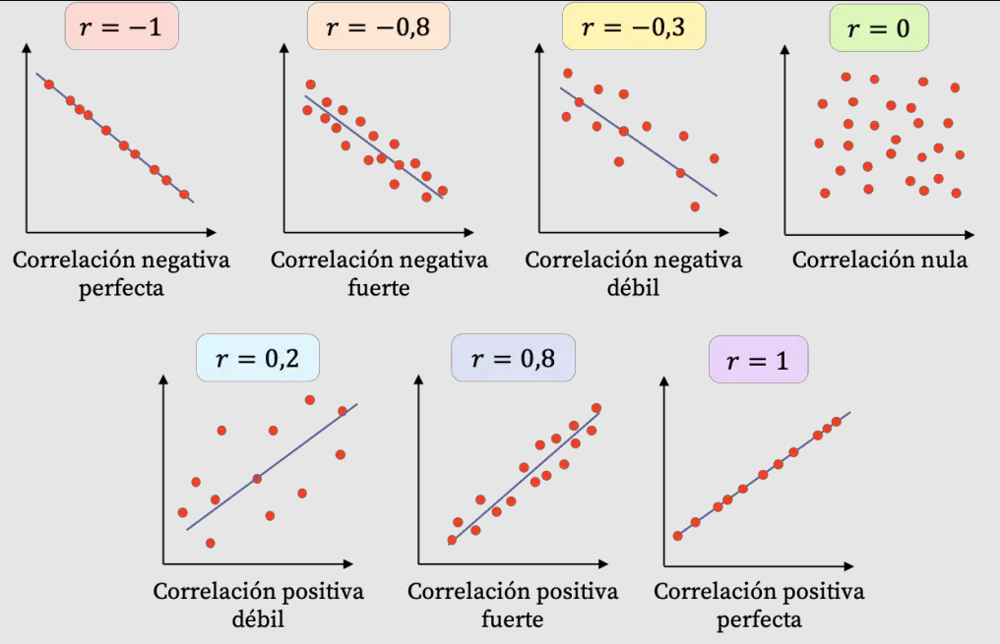
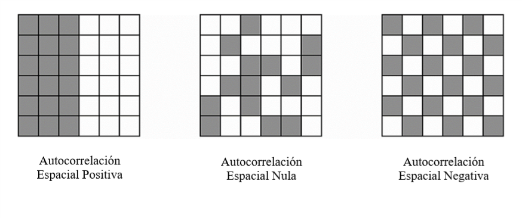
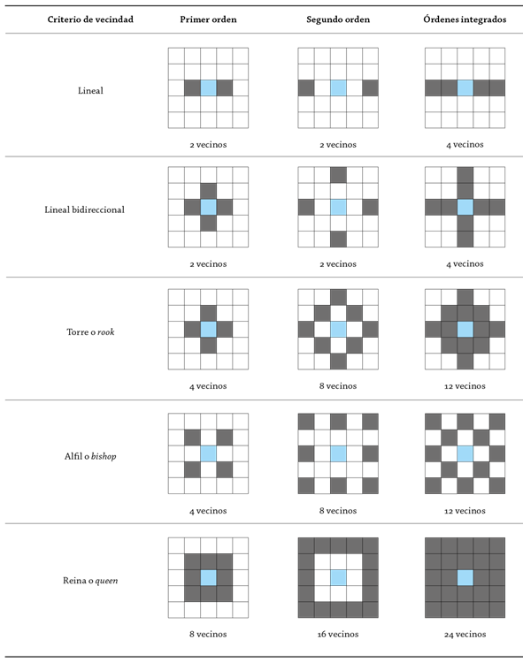
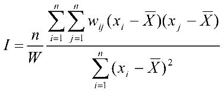

# Mapas en acción: Análisis y visualización espacial con R

## 4. Analítica avanzada

Despejando el ruido. Aquí se buscará identificar patrones regionales del voto en la Ciudad de Buenos Aires.

## 4.1. Pregunta-problema

El objetivo será analizar las elecciones en la Ciudad de Buenos Aires a nivel de circuito electoral. ¿Cómo es el patrón regional del voto en la Ciudad de Buenos Aires?

Cargamos las librerías.

```{r}
library(tidyverse)
library(sf)
library(patchwork)
library(spdep) 
```

## 4.2. Unidades de agregación

La información electoral tiene distintos niveles de agregación. En general se trabaja a nivel distrito (provincias), a nivel sección o a nivel circuitos electorales.

```{r}
cir <- st_read(params$ruta_circuitos_caba) %>% 
  mutate(indice_feminidad = FEMENINO / MASCULINO * 100)

dim(cir)
head(cir,2)
```

Se realiza la agregación espacial para conseguir la geometría a nivel sección y a nivel distrito.

```{r}
sec <- cir %>% 
  group_by(COMUNA) %>% 
  summarise(geometry = st_union(geometry),
            MASCULINO = sum(MASCULINO),
            FEMENINO = sum(FEMENINO)) %>% 
  mutate(indice_feminidad = FEMENINO / MASCULINO * 100) 

dis <- cir %>% 
  mutate(distrito="CABA") %>% 
  group_by(distrito) %>% 
  summarise(geometry = st_union(geometry),
            MASCULINO = sum(MASCULINO),
            FEMENINO = sum(FEMENINO)) %>% 
  mutate(indice_feminidad = FEMENINO / MASCULINO * 100) 

ggplot()+
  geom_sf(data=cir, aes(color="Circuito"), fill=NaN)+
  geom_sf(data=sec, aes(color="Sección"), fill=NaN)+
  geom_sf(data=dis, aes(color="Distrito"), fill=NaN)+
  scale_color_manual(name = "Nivel",  values = c("Circuito" = "gray","Sección" = "black","Distrito" = "red"))+
  labs(title="Ciudad de Buenos Aires",
       subtitle="Niveles de agregación para información electoral")+
  theme_void()
  
```

Cada nivel de agregación requiere su propio cálculo, ya que cada unidad pesan de manera diferencial en el agregado.

```{r}
limites <- range(
  c(dis$indice_feminidad, sec$indice_feminidad, cir$indice_feminidad))

plot_dis <- ggplot(data=dis)+
  geom_sf(aes(fill=indice_feminidad), color="black")+
  scale_fill_viridis_c(limits = limites)+
  labs(title="Distrito")+
  theme_void()

plot_sec <- ggplot(data=sec)+
  geom_sf(aes(fill=indice_feminidad), color="black")+
  scale_fill_viridis_c(limits = limites)+
  labs(title="Sección")+
  theme_void()

plot_cir <- ggplot(data=cir)+
  geom_sf(aes(fill=indice_feminidad))+
  geom_sf(data=sec, color="black", fill=NaN)+
  scale_fill_viridis_c(limits = limites)+
  labs(title="Circuito")+
  theme_void()

(plot_dis + plot_sec + plot_cir) + 
  plot_layout(guides = "collect") &
  theme(legend.position = "bottom",
    legend.key.width = unit(3, "cm"),  
    legend.key.height = unit(0.3, "cm"))
```

Carguemos las bases de datos.

```{r}
# seleccionamos las columnas imprescindibles
cir_clean <- cir %>% 
  select(CIRCUITO_N, geometry)

# cargamos resultados y pegamos a la base de circuitos
gdf <- read_csv(params$ruta_resultados_caba) %>%
  filter(anio==2023) %>% 
  mutate(porcentaje = votos / votos_totales * 100) %>% 
  left_join(cir_clean, by=c("circuito"="CIRCUITO_N")) %>% 
  st_as_sf()
  
head(gdf,2) 
```

## 4.3. Autocorrelación espacial

El uso de herramientas estadísticas para cuantificar y clarificar el análisis de datos (en complemento con la visualización) es indispensable para una correcta comprensión de los fenómenos. Para explorar la relación lineal entre variables se suelen utilizar coeficientes de correlación. Permiten identificar la dirección y la intensidad de las asociaciones lineales entre los distintos indicadores.



En nuestro ejemplo, podemos ver la relación entre el voto entre dos fuerzas políticas.

```{r}
gdf %>% 
  st_drop_geometry() %>% 
  filter(partido %in% c("juntos por el cambio", "union por la patria")) %>% 
  select(circuito, partido, porcentaje) %>% 
  pivot_wider(id_cols="circuito", names_from="partido", values_from="porcentaje") %>% 
  mutate(cor = cor(`juntos por el cambio`, `union por la patria`, use = "complete.obs")) %>% 
  ggplot(aes(x=`juntos por el cambio`, y=`union por la patria`))+
  geom_point()+
  geom_smooth(method="lm")+
  geom_text(aes(x=60, y=40, label=paste0("r = ", round(first(cor),2))))+
  labs(title="Relación entre el voto a JxC y UxP",
       subtitle="Resultados electorales por circuito - CABA G2023")+
  theme_minimal()
```

Veamos una segunda relación entre otros espacios.

```{r}
gdf %>% 
  st_drop_geometry() %>% 
  filter(partido %in% c("blanco", "fit-u")) %>% 
  select(circuito, partido, porcentaje) %>% 
  pivot_wider(id_cols="circuito", names_from="partido", values_from="porcentaje") %>% 
  mutate(cor = cor(`blanco`, `fit-u`, use = "complete.obs")) %>% 
  ggplot(aes(x=`blanco`, y=`fit-u`))+
  geom_point()+
  geom_smooth(method="lm")+
  geom_text(aes(x=20, y=10, label=paste0("r = ", round(first(cor),2))))+
  labs(title="Relación entre el voto a FIT-U y UxP",
       subtitle="Resultados electorales por circuito - CABA G2023")+
  theme_minimal()
```

Al trabajar con datos espaciales, la relación entre los valores de una variable consigo misma se ven de esta forma.



¿Cómo ver si una fuerza tiene patrones espaciales?

```{r}
gdf %>% 
  filter(partido == "la libertad avanza") %>% 
  ggplot()+
  geom_sf(aes(fill=porcentaje)) +
  geom_sf(data=sec, color="black", fill=NaN, linewidth=.7)+
  scale_fill_fermenter(palette = "Purples", direction = 1)+
  labs(title="La Libertad Avanza (%)",
       subtitle="Resultados electorales por circuito - CABA G2023")+
  theme_void()
```

La definición clave es: ¿con qué relacionamos cada unidad? Con sus **vecinos**.



Trabajaremos en formato *wide* para que sea más cómoda de manipular la base de datos.

```{r}
partidos <- c("la libertad avanza", "union por la patria", "juntos por el cambio")
gdf_w <- gdf %>% 
  st_drop_geometry() %>% 
  filter(partido %in% partidos) %>% 
  pivot_wider(id_cols="circuito", names_from="partido", values_from="porcentaje") %>% 
  left_join(cir_clean, by=c("circuito"="CIRCUITO_N")) %>% 
  st_as_sf()


vecinos <- poly2nb(gdf_w, row.names = gdf_w$circuito, queen = T)
pesos <- nb2listw(vecinos, style="minmax", zero.policy=T)
serie_lla <- gdf_w$`la libertad avanza`
ids <- gdf_w$circuito

class(vecinos)
vecinos[1:2]
#View(vecinos)
```

Veamoslo gráficamente.

```{r}
circuito_objetivo <- 60

ggplot()+
  geom_sf(data=cir, color="black")+
  geom_sf(data=filter(cir, CIRCUITO_N==circuito_objetivo), aes(fill="Objetivo"), color="black")+
  geom_sf(data=filter(cir, CIRCUITO_N %in% vecinos[circuito_objetivo][[1]]), aes(fill="Vecinos"), color="black")+
  scale_fill_manual(name = "Clasificación",  values = c("Objetivo" = "green","Vecinos" = "darkgreen"))+
  labs(title="Circuitos electorales en CABA")+
  theme_void()
```

## 4.4. Medida global: índice I de Moran

El índice I de Moran es una medida clásica de autocorrelación espacial que permite evaluar en qué medida los valores de una variable se agrupan en el espacio. Este indicador toma valores entre –1 y 1. Los valores positivos indican una autocorrelación espacial positiva —áreas con valores similares tienden a agruparse—, mientras que los valores negativos reflejan una autocorrelación negativa, donde unidades con valores altos suelen estar rodeadas de unidades con valores bajos (y viceversa). Un valor cercano a cero sugiere ausencia de patrón espacial, es decir, una distribución aleatoria.

El análisis del índice de Moran global ofrece una visión sintética del grado de dependencia espacial en la región analizada, funcionando como una “correlación espacial” general. Se complementa con el cálculo del valor p que indica si la autocorrelación observada es estadísticamente significativa o podría explicarse por azar.



Calculemos el índice para nuestra serie.

```{r}
i_moran <- moran(serie_lla, # serie
                 n = length(vecinos), # cantidad de zonas
                 listw = pesos, # pesos         
                 S0 = Szero(pesos) #suma de los pesos
                 )[[1]]

paste0("I Moran de LLA: ",round(i_moran,3))
```

Confirmamos significancia estadística.

```{r}
moran.test(serie_lla, pesos)
```

Veamos un diagrama de dispersión entre cada valor y el promedio de sus vecinos.

```{r}
moran_df <- moran.plot(serie_lla, 
                       listw = pesos, 
                       zero.policy = TRUE, 
                       labels = ids)
```

Las variables que nos interesan:

-   `x`: es el valor estandarizado de la variable que se está estudiando.

-   `wx:` es el valor lag de la variable.

-   `labels:` las etiquetas de la variable.

```{r}
moran_df %>% 
  select(x, wx, labels) %>% 
  head()
```

## 4.5. Medida local: LISA

Para considerar la heterogeneidad especial podemos hacer uso de índices de asociación espacial locales. En el caso del índice I de Moran, existe su versión desagregada para analizar cómo varía la relación entre cada punto y sus vecinos.

```{r}
i_moran_local <- localmoran(serie_lla, listw = pesos)
i_moran_local <- cbind(i_moran_local, 
                       attributes(i_moran_local)$quadr,
                       select(moran_df, x, wx, labels)) %>% 
  rename(p = `Pr(z != E(Ii))`, 
         cuadrante = mean) %>% 
  select(x, wx, labels, Ii, p, cuadrante) %>% 
  mutate(cuadrante_v2 = case_when(p > 0.05 ~ "ns",
                                  TRUE ~ cuadrante))

i_moran_local %>% 
  head()
#pendiente: repetir diagrama de dispersión pero coloreando HH LL significativdad
# mapa coloreado para LLA 

```

Las variables que nos interesan son las siguientes. - `Ii`: Valor del Moran local - `Pr(...)`: p-value del Moran local - `Cuadrante (mean)` : Cuadrante donde podemos clasificar el Moran local.

Repliquemos el gráfico anterior pero señalando los cuadrantes.

```{r}
nombres <- unique(i_moran_local$cuadrante_v2)
nombres <- c("ns","High-High", "High-Low","Low-High","Low-Low")
colores <- c("gray","red", "lightpink", "skyblue", "blue")
names(colores) <- nombres

i_moran_local %>% 
  ggplot(aes(x=x, y=wx))+
  geom_hline(linetype = 2, yintercept = mean(i_moran_local$wx)) +
  geom_vline(linetype = 2, xintercept = mean(i_moran_local$x)) +
  geom_point(aes(color=cuadrante_v2))+
  geom_smooth(method="lm", se=F, color="black", linewidth=.5)+
  scale_color_manual(values=colores)+
  labs(x="serie", y="lagged")+
  theme_minimal()

```

¿Cómo lo incorporamos al análisis?

```{r}
i_moran_local_short <- i_moran_local %>% select(labels, cuadrante_v2) 

plot_lla <- gdf_w %>% 
  left_join(i_moran_local_short, by=c("circuito" =  "labels")) %>% 
  ggplot()+
  geom_sf(aes(fill=cuadrante_v2))+
  geom_sf(data=sec, color="black", fill=NaN, linewidth=.7)+
  scale_fill_manual(values=colores)+
  labs(title="La Libertad Avanza",
       subtitle=paste0("I Moran Global: ", round(i_moran,3)))+
  theme_void()

plot_lla
```

Replicamos para el resto de los partidos.

```{r}
serie_uxp <- gdf_w$`union por la patria`
serie_jxc <- gdf_w$`juntos por el cambio`

# moran global
mg_uxp <- moran(serie_uxp, n = length(vecinos),listw = pesos, S0 = Szero(pesos))[[1]]
mg_jxc <- moran(serie_jxc, n = length(vecinos),listw = pesos, S0 = Szero(pesos))[[1]]

# x, wx, labels
mdf_uxp <- moran.plot(serie_uxp, listw = pesos, zero.policy = TRUE, labels = ids)
mdf_jxc <- moran.plot(serie_jxc, listw = pesos, zero.policy = TRUE, labels = ids)

# moran local
ml_uxp <- localmoran(serie_uxp, listw = pesos)
ml_uxp <- cbind(ml_uxp, attributes(ml_uxp)$quadr,select(mdf_uxp, x, wx, labels)) %>% 
  rename(p = `Pr(z != E(Ii))`, 
         cuadrante = mean) %>% 
  select(x, wx, labels, Ii, p, cuadrante) %>% 
  mutate(cuadrante_v2 = case_when(p > 0.05 ~ "ns",TRUE ~ cuadrante))

ml_jxc <- localmoran(serie_jxc, listw = pesos)
ml_jxc <- cbind(ml_jxc, attributes(ml_jxc)$quadr,select(mdf_jxc, x, wx, labels)) %>% 
  rename(p = `Pr(z != E(Ii))`, 
         cuadrante = mean) %>% 
  select(x, wx, labels, Ii, p, cuadrante) %>% 
  mutate(cuadrante_v2 = case_when(p > 0.05 ~ "ns",TRUE ~ cuadrante))

# short
ml_uxp_short <- ml_uxp %>% select(labels, cuadrante_v2) 
ml_jxc_short <- ml_jxc %>% select(labels, cuadrante_v2) 

plot_uxp <- gdf_w %>% 
  left_join(ml_uxp_short, by=c("circuito" =  "labels")) %>% 
  ggplot()+
  geom_sf(aes(fill=cuadrante_v2))+
  geom_sf(data=sec, color="black", fill=NaN, linewidth=.7)+
  scale_fill_manual(values=colores)+
  labs(title="Unión por la Patria",
       subtitle=paste0("I Moran Global: ", round(mg_uxp,3)))+
  theme_void()

plot_jxc <- gdf_w %>% 
  left_join(ml_jxc_short, by=c("circuito" =  "labels")) %>% 
  ggplot()+
  geom_sf(aes(fill=cuadrante_v2))+
  geom_sf(data=sec, color="black", fill=NaN, linewidth=.7)+
  scale_fill_manual(values=colores)+
  labs(title="Juntos por el Cambio",
       subtitle=paste0("I Moran Global: ", round(mg_jxc,3)))+
  theme_void()

```

Veamos comparativamente las tres fuerzas. Primero los resultados, después su autocorrelación espacial.

```{r}
partidos <- c("la libertad avanza", "union por la patria", "juntos por el cambio")
gdf %>% 
  filter(partido %in% partidos) %>% 
  ggplot()+
  geom_sf(aes(fill=porcentaje)) +
  geom_sf(data=sec, color="black", fill=NaN, linewidth=.7)+
  scale_fill_viridis_c()+
  facet_wrap(~partido)+
  labs(title="Resultados electorales por circuito (%) - CABA G2023\n")+
  theme_void()+
  theme(plot.title = element_text(hjust=0.5))
```

Las escalas diferenciadas complican la lectura. Normalicemos desde los datos para poder aplicar el facetado.

```{r}
gdf %>% 
  filter(partido %in% partidos) %>%
  group_by(partido) %>% 
  mutate(porcentaje_norm=(porcentaje - min(porcentaje)) / (max(porcentaje)-min(porcentaje)) ) %>% 
  ungroup() %>% 
  ggplot()+
  geom_sf(aes(fill=porcentaje_norm)) +
  geom_sf(data=sec, color="black", fill=NaN, linewidth=.7)+
  scale_fill_viridis_c()+
  facet_wrap(~partido)+
  labs(title="Resultados electorales por circuito (%) - CABA G2023\n",
       fill="Max")+
  theme_void()+
  theme(plot.title = element_text(hjust=0.5), 
        legend.text = element_blank())
```

Finalmente, vemos los cuadrantes.

```{r}
(plot_lla + plot_jxc + plot_uxp)+
  plot_layout(guides="collect", ncol=3)+
  plot_annotation(title="Autocorrelación espacial")
```

## 🧪 Práctica (15 minutos)

-   Calcular el índice I de Moran Local para LLA en el año 2025. Analizar los patrones geográficos del voto a La Libertad Avanza en el año 2023 y en el año 2025. ¿Qué pueden decir al respecto?
